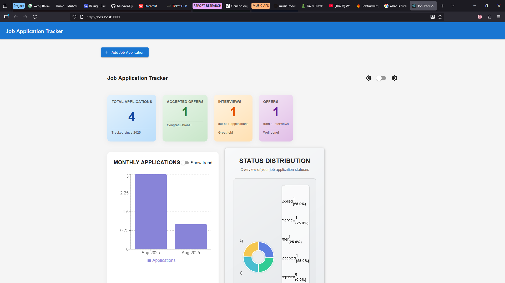
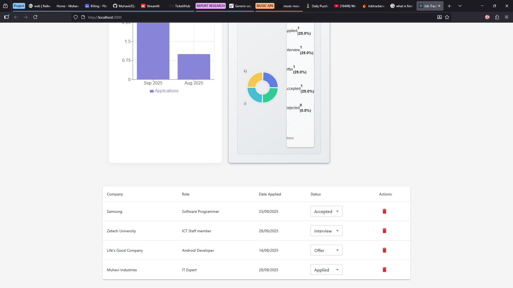
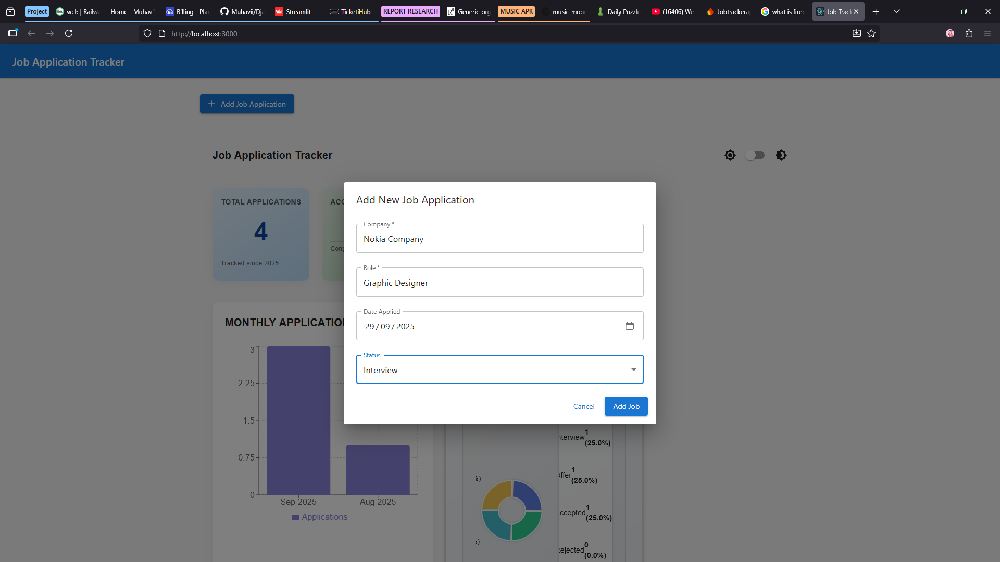

# Job Application Tracker

A modern web application to track your job applications, built with React, TypeScript, Material-UI, and Firebase.

## Features

- 📝 Add and manage job applications
- 📊 Track application status (Applied, Interview, Offer, Rejected)
- 📈 View application statistics and success rates
- 📱 Responsive design that works on all devices
- 🔒 Secure authentication with Firebase
- 📊 Interactive charts with Recharts

## Screenshots






*Dashboard showing application statistics and status distribution*


## Getting Started

### Prerequisites

- Node.js (v14 or later)
- npm or yarn
- Firebase account (for backend services)

### Installation

1. Clone the repository
   ```bash
   git clone https://github.com/your-username/job-tracker.git
   cd job-tracker
   ```

2. Install dependencies
   ```bash
   npm install
   # or
   yarn
   ```

3. Set up Firebase
   - Create a new Firebase project at [Firebase Console](https://console.firebase.google.com/)
   - Enable Firestore Database and Authentication (Email/Password) in your Firebase project
   - Create a web app in your Firebase project and copy the configuration

4. Create a `.env` file in the root directory and add your Firebase configuration:
   ```env
   REACT_APP_FIREBASE_API_KEY=your_api_key_here
   REACT_APP_FIREBASE_AUTH_DOMAIN=your_project_id.firebaseapp.com
   REACT_APP_FIREBASE_PROJECT_ID=your_project_id
   REACT_APP_FIREBASE_STORAGE_BUCKET=your_project_id.appspot.com
   REACT_APP_FIREBASE_MESSAGING_SENDER_ID=your_messaging_sender_id
   REACT_APP_FIREBASE_APP_ID=your_app_id
   REACT_APP_FIREBASE_MEASUREMENT_ID=your_measurement_id
   ```

5. Start the development server
   ```bash
   npm start
   # or
   yarn start
   ```

6. Open [http://localhost:3000](http://localhost:3000) to view it in your browser.

## Available Scripts

In the project directory, you can run:

### `npm start` or `yarn start`

Runs the app in development mode.\
Open [http://localhost:3000](http://localhost:3000) to view it in the browser.

The page will reload when you make changes.\
You may also see any lint errors in the console.

### `npm test` or `yarn test`

Launches the test runner in interactive watch mode.\
See the section about [running tests](https://facebook.github.io/create-react-app/docs/running-tests) for more information.

### `npm run build` or `yarn build`

Builds the app for production to the `build` folder.\
It correctly bundles React in production mode and optimizes the build for the best performance.

The build is minified and the filenames include the hashes.\
Your app is ready to be deployed!

## Technologies Used

- [React](https://reactjs.org/) - JavaScript library for building user interfaces
- [TypeScript](https://www.typescriptlang.org/) - Typed superset of JavaScript
- [Material-UI](https://mui.com/) - React UI component library
- [Firebase](https://firebase.google.com/) - Backend services (Authentication, Firestore)
- [Recharts](https://recharts.org/) - Charting library for React
- [React Router](https://reactrouter.com/) - Routing for React applications

## License

This project is licensed under the MIT License - see the [LICENSE](LICENSE) file for details.

### `npm run build`

Builds the app for production to the `build` folder.\
It correctly bundles React in production mode and optimizes the build for the best performance.

The build is minified and the filenames include the hashes.\
Your app is ready to be deployed!

See the section about [deployment](https://facebook.github.io/create-react-app/docs/deployment) for more information.

### `npm run eject`

**Note: this is a one-way operation. Once you `eject`, you can’t go back!**

If you aren’t satisfied with the build tool and configuration choices, you can `eject` at any time. This command will remove the single build dependency from your project.

Instead, it will copy all the configuration files and the transitive dependencies (webpack, Babel, ESLint, etc) right into your project so you have full control over them. All of the commands except `eject` will still work, but they will point to the copied scripts so you can tweak them. At this point you’re on your own.

You don’t have to ever use `eject`. The curated feature set is suitable for small and middle deployments, and you shouldn’t feel obligated to use this feature. However we understand that this tool wouldn’t be useful if you couldn’t customize it when you are ready for it.

## Learn More

You can learn more in the [Create React App documentation](https://facebook.github.io/create-react-app/docs/getting-started).

To learn React, check out the [React documentation](https://reactjs.org/).
